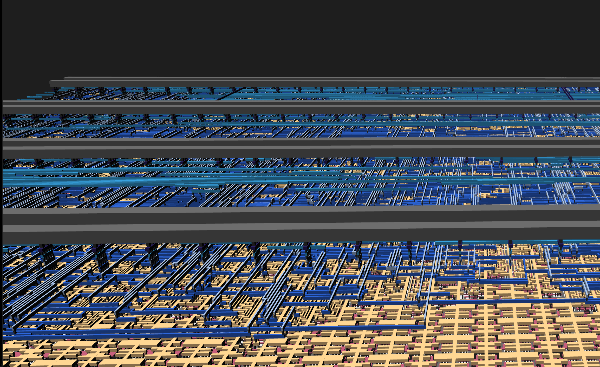
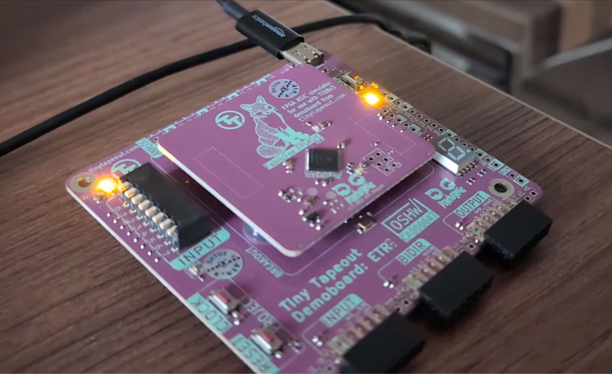
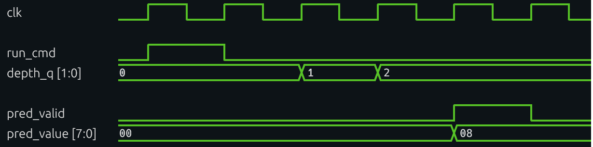
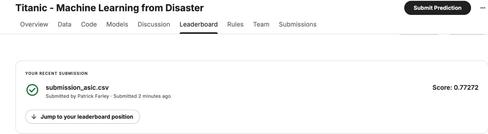

   

# TOPHAT: TapeOut Prediction with Hardware Acceleration for Trees

A hardware decision-tree inference engine for small, fixed-shape trees. The current implementation targets a depth-3 tree with 8 input features, 7 internal nodes, and 8 leaves. 

Protocol and usage documentation can be found [here](docs/info.md).

Click the image to open the GDS viewer:

<a href="https://blog.patfarley.org/tophat/">
  
</a>

<br><br>

The repository includes:

- RTL for model load, feature load, and tree traversal; synthesizable for FPGA prototyping and hardenable with LibreLane for ASIC tapeout.
- Host and board-side tooling for exercising the design on Tiny Tapeout hardware.
- An end-to-end example showing how a software-trained tree can be quantized, serialized, and run through the inference engine.

TOPHAT is implemented as a Tiny Tapeout project and is on the Tiny Tapeout IHP 26a shuttle for ASIC tapeout. Tiny Tapeout is an educational project that aims to make it easy and cheap to get digital and analog designs manufactured. Shuttle status is [here](https://app.tinytapeout.com/shuttles/ttihp26a), the project physical chip location is [here](https://app.tinytapeout.com/projects/3648), and more about Tiny Tapeout is at https://tinytapeout.com.


## Board example package

Deployable MicroPython example code lives in [`examples/`](examples/README.md), structured to match TinyTapeout firmware `src/examples`.



## Latency

TOPHAT evaluates one tree level per clock. With the current depth-3 tree, the core produces a prediction 3 cycles after `run`. Including the input command cycle, the pin-level `CMD_CTRL run` write to `pred_valid` is 4 cycles, or `80 ns` at the `20 ns` (`50 MHz`) clock period used in the LibreLane timing configuration.



## Demo

The repo also includes a hardware-inference example based on Kaggle's "Machine Learning from Disaster" competition.

- Uses scikit-learn to train a tree that fits TOPHAT's hardware constraints.
- Serializes the trained model into the 22-byte TOPHAT model image.
- Runs inference on hardware.
- Generates a Kaggle-compatible submission CSV from the resulting predictions.

See [docs/titanic-asic-demo.md](docs/titanic-asic-demo.md) for the walkthrough and [tools/demo/titanic_asic_demo.py](tools/demo/titanic_asic_demo.py) for the end-to-end script.



## Local test run

Create a virtualenv and install the test dependencies. An install of Icarus Verilog is required.

```sh
python3 -m venv .venv
source .venv/bin/activate
python -m pip install -r requirements.txt
```

Run the cocotb RTL simulation only:

```sh
source .venv/bin/activate
cd test
make test-cocotb
```

Run the full local test suite:

```sh
source .venv/bin/activate
cd test
make test-all
```
