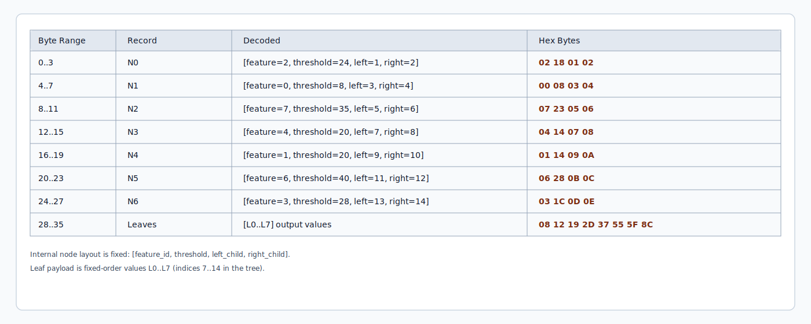
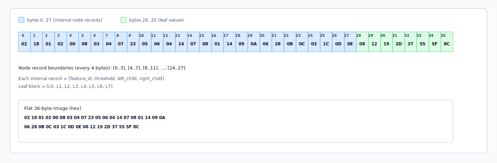

# TOPHAT: Tapeout Prediction with Hardware Acceleration for Trees

TOPHAT is a hardware decision-tree inference engine for a fixed depth-3 tree (7 internal nodes, 8 leaves) with 8 input features.

## Usage

### Background

A decision tree is a supervised learning model that predicts an output by applying a sequence of simple feature-based tests (for example, `feature_i < threshold`). Training determines which tests to use and where to place them so the model separates examples effectively.

At inference time, prediction traverses from the root to a leaf based on comparison results. In hardware, the model is represented as fixed node parameters plus deterministic control flow.

For a well-known example of the kind of problem to which a decision tree can be applied, see Kaggle's [Titanic - Machine Learning from Disaster](https://www.kaggle.com/competitions/titanic).

### Model Representation

TOPHAT consumes a fixed 36-byte model image:

- Bytes `0..27`: 7 internal nodes, 4 bytes per node in the order `[feature_id, threshold, left_child, right_child]`
- Bytes `28..35`: 8 leaf values, 1 byte per leaf

| Field | Bits | Note |
| --- | --- | --- |
| `feature_id` | 3 | Supports 8 features |
| `threshold` | 8 | Unsigned |
| `left_child` | 4 | `0..6` = internal node, `7..14` = leaf node |
| `right_child` | 4 | Same encoding as `left_child` |

#### Example Model Serialization

Any model can be used as long as it is serialized into the format above. The example below is generated with `scikit-learn`. See `test/generate_golden_tree.py` for details. For more background on `scikit-learn` trees, see the [scikit-learn Decision Trees documentation](https://scikit-learn.org/stable/modules/tree.html).

Tree structure and indices:

Encoding:

36-byte model image:

### Feature Representation

Lorem ipsum dolor.

### Control Protocol

#### Loading a Model

Lorem ipsum dolor.

#### Prediction

Lorem ipsum dolor.

## How It Works

### Block Diagram

Lorem ipsum dolor.

### Module Descriptions

Lorem ipsum dolor.

## How to Test

Lorem ipsum dolor.

## Acknowledgments

Thanks to [BLAKE2s Hashing Accelerator: A Solo Tapeout Journey](https://essenceia.github.io/projects/blake2s_hashing_accelerator_a_solo_tapeout_journey/) for the inspiration.
