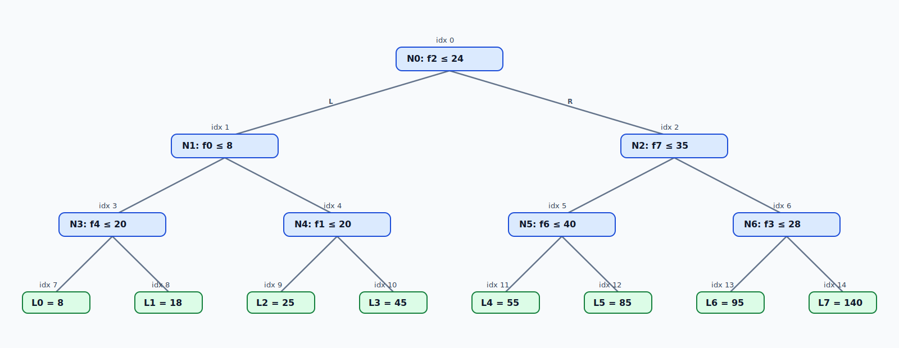

# TOPHAT: Tapeout Prediction with Hardware Acceleration for Trees

TOPHAT is a hardware decision-tree inference engine for a fixed depth-3 tree (7 internal nodes, 8 leaves) with 8 input features.

## Usage

### Background

A decision tree is a supervised learning model that predicts an output by applying a sequence of simple feature-based tests (for example, `feature_i < threshold`). Training determines which tests to use and where to place them so the model separates examples effectively.

At inference time, prediction traverses from the root to a leaf based on comparison results. In hardware, the model is represented as fixed node parameters plus deterministic control flow.

For a well-known example of the kind of problem to which a decision tree can be applied, see Kaggle's [Titanic - Machine Learning from Disaster](https://www.kaggle.com/competitions/titanic).

### Model Representation

TOPHAT consumes a fixed 22-byte model image:

- Bytes 0..13: 7 internal nodes, 2 bytes per node in the order [feature_id, threshold]
- Bytes 14..21: 8 leaf values, 1 byte per leaf

| Field | Bits | Note |
| --- | --- | --- |
| feature_id | 3 | Supports 8 features |
| threshold | 8 | Unsigned |

Child selection is implicit from node index `i` (dense full binary tree):

- left child index: `2*i + 1`
- right child index: `2*i + 2`

#### Example Model Serialization

Any model can be used as long as it is serialized into the format above. The example below was generated with scikit-learn. See `test/generate_golden_tree.py` for details. For more background on scikit-learn trees, see the [scikit-learn Decision Trees documentation](https://scikit-learn.org/stable/modules/tree.html).



| Byte Range | Record | Decoded | Hex Bytes |
| --- | --- | --- | --- |
| 0..1 | N0 | [feature=2, threshold=24] | 02 18 |
| 2..3 | N1 | [feature=0, threshold=8] | 00 08 |
| 4..5 | N2 | [feature=7, threshold=35] | 07 23 |
| 6..7 | N3 | [feature=4, threshold=20] | 04 14 |
| 8..9 | N4 | [feature=1, threshold=20] | 01 14 |
| 10..11 | N5 | [feature=6, threshold=40] | 06 28 |
| 12..13 | N6 | [feature=3, threshold=28] | 03 1C |
| 14..21 | Leaves | [L0..L7] output values | 08 12 19 2D 37 55 5F 8C |

### Feature Representation

TOPHAT feature input is a fixed 8-byte vector with each feature encoded as an unsigned 8-bit value.
In the Titanic demo, the bytes encode passenger class, sex, age, siblings/spouses aboard, parents/children aboard, fare, port of embarkation, and whether the passenger is traveling alone, in that order.

Example Feature Serialization

| Feature ID | Passenger Attribute (example value) | Hex Byte |
| --- | ---  | --- |
| 0 | Passenger class (`3rd class`) | FF |
| 1 | Sex (`male`) | FF |
| 2 | Age (`22 years`) | 45 |
| 3 | Siblings/spouses aboard (`1`) | 20 |
| 4 | Parents/children aboard (`0`) | 00 |
| 5 | Ticket fare (`7.25`) | 04 |
| 6 | Port of embarkation (`Southampton`) | 00 |
| 7 | Traveling alone (`no`) | 00 |

### Control Protocol

TOPHAT uses a byte-wide command and payload interface:

| Signal | Direction | Description |
| --- | --- | --- |
| `ui_in[7:0]` | input | Payload byte |
| `uio_in[0]` | input | `valid` strobe |
| `uio_in[2:1]` | input | Command select |
| `uio_out[3]` | output | `ready` (`~busy`) |
| `uio_out[4]` | output | `busy` |
| `uio_out[5]` | output | `pred_valid` pulse |
| `uio_out[6]` | output | `model_loaded` |
| `uio_out[7]` | output | `error_or_missing_features` (`error | ~features_loaded`) |

A transfer is accepted on a rising clock edge only when `valid=1` and `ready=1`.

| `uio_in[2:1]` | Name | `ui_in[7:0]` payload |
| --- | --- | --- |
| `2'b00` | `CMD_MODEL` | Model byte stream |
| `2'b01` | `CMD_FEATURE` | Feature byte stream |
| `2'b10` | `CMD_CTRL` | Bit0=`run`, bit1=`clear` |
| `2'b11` | Reserved | Ignored |

#### Loading a Model

1. Wait until `ready=1`.
2. Send 22 bytes with `CMD_MODEL` (`2'b00`), one accepted transfer per byte.
3. Bytes `0..13` are node records, bytes `14..21` are leaf values. See "Model Representation" above.
4. `model_loaded` (`uio_out[6]`) asserts after the 22nd byte is accepted.

Notes:
- `CMD_CTRL` with `clear=1` (`ui_in[1]=1`) resets model, features, status, and core state.
- Starting a new model stream deasserts `model_loaded` until all 22 bytes are reloaded.

#### Prediction

1. Load 8 feature bytes with `CMD_FEATURE` (`2'b01`), byte 0 through byte 7. See "Feature Representation" above.
2. Wait for `ready=1`, then send `CMD_CTRL` with `run=1` (`ui_in[0]=1`).
3. If model and features are both loaded, core enters `busy=1` traversal and returns with a one-cycle `pred_valid` pulse.
4. Read prediction from `uo_out[7:0]` when `pred_valid=1`.
5. A consumed run clears `features_loaded`, so features must be reloaded before the next prediction.

| Status bit | Meaning |
| --- | --- |
| `uio_out[3]` | `ready = ~busy` |
| `uio_out[5]` | One-cycle `pred_valid` when a result is produced |
| `uio_out[7]` | `error OR ~features_loaded` |

| Run condition | Behavior |
| --- | --- |
| `model_loaded=1` and `features_loaded=1` | Normal traversal, valid prediction on `uo_out` |
| Missing model or features | Run is rejected, `error` is set |

## How It Works

### Block Diagram

Lorem ipsum dolor.

### Module Descriptions

Lorem ipsum dolor.

## How to Test

### Automated (Simulation)

The test suite lives in `test/` and requires [cocotb](https://www.cocotb.org/), Icarus Verilog, and the Python packages listed in `test/requirements.txt`. From a virtualenv:

```bash
cd test
pip install -r requirements.txt
```

**RTL simulation** (cocotb + Icarus Verilog):

```bash
make test-cocotb   # builds the sim and runs test/test.py under cocotb
```

The cocotb test (`test/test.py`) performs a full end-to-end check:

1. Resets the DUT and issues a `CMD_CTRL` clear.
2. Loads the 22-byte golden model image (`golden_model.bin`) byte-by-byte with `CMD_MODEL` and waits for `model_loaded`.
3. For each fixture case, loads 8 feature bytes with `CMD_FEATURE`, sends `CMD_CTRL` with `run=1`, and reads the prediction from `uo_out` on the `pred_valid` pulse.
4. Compares the DUT prediction against both the fixture's expected value and a scikit-learn golden model.

**Python-only tests** (no simulator needed):

```bash
make test-python   # runs pytest on test_golden_model.py, test_host_client.py, etc.
```

These cover:

- **Golden-model parity** (`test_golden_model.py`): verifies the scikit-learn decision tree reproduces every fixture case.
- **Host client** (`test_host_client.py`): validates model/feature payload formatting, length checks, and CLI argument parsing against a fake transport.
- **Host transport** (`test_host_transport.py`): tests JSON-line serial framing, echo filtering, and timeout behavior with a fake serial port.
- **Example assets** (`test_example_assets.py`): ensures the published example fixtures and model image match the test golden references.

**Run everything** (simulation + Python tests):

```bash
make test-all  # clean build, then runs cocotb and pytest
```

### Manual (Hardware)

With the design active on a Tiny Tapeout board and the RP2040 bridge firmware running:

1. Connect via USB serial (the board enumerates as a CDC device, e.g. `/dev/ttyACM0`).
2. Use the host CLI (`tools/host/tophat_host.py`) to interact:

```bash
# Check the bridge is alive
python tools/host/tophat_host.py ping --port /dev/ttyACM0

# Clear any previous state
python tools/host/tophat_host.py clear --port /dev/ttyACM0

# Load the 22-byte model image
python tools/host/tophat_host.py load-model --port /dev/ttyACM0 --model test/golden_model.bin

# Run a prediction with an inline feature vector
python tools/host/tophat_host.py predict --port /dev/ttyACM0 --features 4,6,10,12,15,20,10,18
```

The `predict` command loads the 8 feature bytes, triggers inference, and prints the prediction byte returned by the hardware.

You can also supply features from a JSON file:

```bash
python tools/host/tophat_host.py predict --port /dev/ttyACM0 --features-file features.json
```

Where `features.json` is either a flat list (`[4,6,10,12,15,20,10,18]`) or an object with keys `feature_00` through `feature_07`.

## Acknowledgments

Thanks to [BLAKE2s Hashing Accelerator: A Solo Tapeout Journey](https://essenceia.github.io/projects/blake2s_hashing_accelerator_a_solo_tapeout_journey/) for the inspiration.
